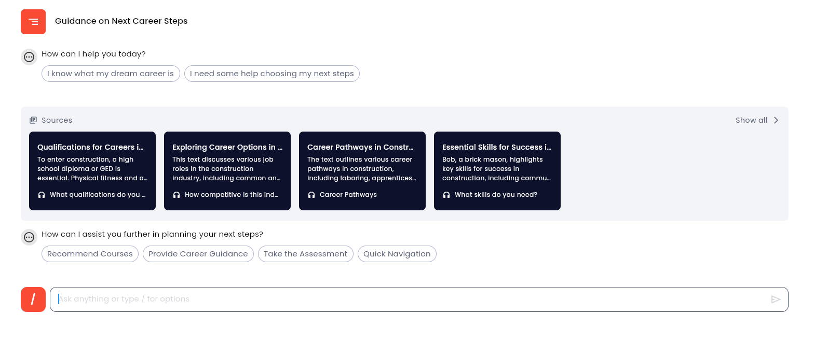
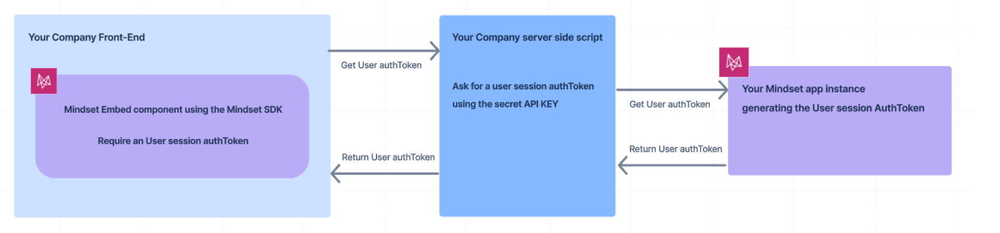
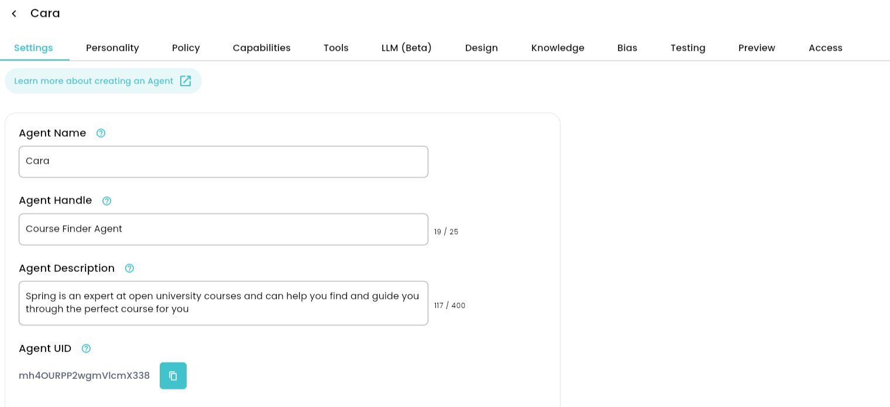
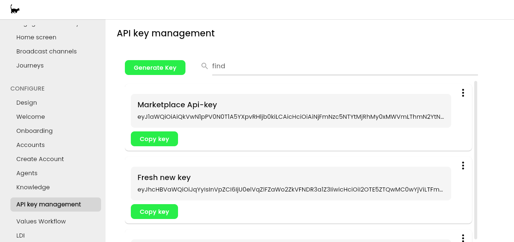

# A Step by Step Guide

## Introduction

Mindset provides Embed SDK to embed the AI agents Components in your web application or portal.

This documentation provides the technical instructions and important points in order achieve that.

_Example of the Mindset Agents component embedded in a web page:_

<figure><figcaption></figcaption></figure>

## Global overview

There are 2 scripts to integrate :

* **Front-End:** One script directly into your web application by including a script reference in the HTML document. This script is hosted on the server where your Mindset application resides.
* **Back-end**: One script on your server which is in charge of getting an authentication token from your Mindset app instance.

<figure><figcaption></figcaption></figure>

## Front-end script

See the Mindset SDK doc for details : [https://docs.mindset.ai/developers/embed-sdk/embed-sdk](https://docs.mindset.ai/developers/embed-sdk/embed-sdk)

Below a sample HTML page including the Javascript script:

```
<html>
    <head>
        <!-- Replace 'YOUR-MINDSET-URL' with the actual URL where your Mindset SDK is hosted -->
        <script src="YOUR-MINDSET-URL/mindset-sdk.js"></script>

        <style>
            .main-container {
                height: 120%;
            }

            .agent-div-class {
                height: 600px;
                width: 80%;
                margin-left: auto;
                margin-right: auto;
                border-radius: 16px;
            }
        </style>
        
    </head>
    <body>
        <div class="main-container">
            <h1>Mindset Embedded Agent</h1>
        
            <div id="check-sdk-div"></div>
            <hr>
            <div id="agent-div" class="agent-div-class"></div>
        
            <script>
                let userEmail = 'useremail@mindset.ai'
                
                <!-- Replace 'YOUR-BACKEND-API-RETURNING-AUTHTOKEN' with the actual URL of your back-end script 
                Fore example: http://mycompany-backend/api/getusertoken/${userEmail} -->
                const userAuthokenServerUrl = `YOUR-BACKEND-API-RETURNING-AUTHTOKEN`
                
                fetch(userAuthokenServerUrl)
                .then((response) => response.json())
                .then(data => {
                    mindset.init({ 
                        appUid: "YOUR-APP-UID", 
                        authToken: data.authToken     <--- Here is injected the final AUTH TOKEN
                    })
                  
                    mindset.render({
                        containerId: "agent-div",
                        component: "agent",
                        options: { agentUid: "YOUR-AGENT-UID" }
                        });
                }
            )
                
            </script>   
        </div> 
    </body>
</html>
```

#### PARAMETERS required to fit your configuration:

YOUR-MINDSET-URL : your Mindset app URL (for example [https://app.mycompany.com)](https://app.mycompany.com\))

YOUR-BACKEND-API-RETURNING-AUTHTOKEN : your BE script URL which need in the request to get the user Email and which will ask the Auth Token to your Mindset app instance (cf the Backen-end script below).\
Sample URL : http://mycompany-backend/api/getusertoken/${userEmail}

YOUR-APP-UID : Your appUid is provided by mindset to you. (it is often just the name of your company).

YOUR-AGENT-UID: The agent Uid you want the user chat with. You can find that Agent Uid in the setting of the agent on the Mindset Admin Ui portal :

<figure><figcaption></figcaption></figure>

#### Note on the user email :

In the previous Front-end script , you can notice that we pass a user Email to the Back-end script.

This User email can be the actual user email as it signed in on your portal. (ex: _username@gmail.com_).

But it can also be a dynamically created email , for example by using the user ID on your portal: (ex: [_user-ID@gmail.com_](mailto:user-ID@gmail.com))

The important concept to understand is the AI agent thread session: if you want that your customers discussions with the AI agents being kept in memory every time he come back on your platform, then you have to use the same email per user.

## Back-end Script

See the Mindset SDK for more details: [https://docs.mindset.ai/developers/embed-sdk/authentication](https://docs.mindset.ai/developers/embed-sdk/authentication)

On your server, you should create an end point which will get the user email as request from your FE side, and which will query an AUTH TOKEN from the Mindset server. This AUTH TOKEN will be injected in the FE script.\
\
Below an example of an EXPRESS API script :

```
import express from "express";


const MINDSET_HOST = `https://europe-west2-mindset-prod2.cloudfunctions.net`;

const mindset_api_key = 'YOUR-MINDSET-API-KEY' 

const app = express();

app.get("/api/getusertoken/:user", async (req, res) => {
  var user  = req.params.user;
  console.log(req.params.user);
  
  try {
    const embedUserToken: any = await axios.post(
      `${MINDSET_HOST}/api-authenticate-embedded-user`,
      {
        userEmail: req.params.user,
      },
      {
        headers: {
            'Content-Type': 'application/json',
            'x-api-key': mindset_api_key
        },
      }
    )
    res.send(embedUserToken.data);
    
  } catch (error: any) {
    console.error(error);
    console.error("Error", error, error.response.status, error.response, error);
    res.status(500).send("Error getting token");
  };
});

export default app;
```

#### PARAMETERS required to fit your configuration:

MINDSET\_HOST: This URL is provided by the Mindset team.

YOUR-MINDSET-API-KEY: This API KEY can be generated in your Mindset App Admin portal:

<figure><figcaption></figcaption></figure>
