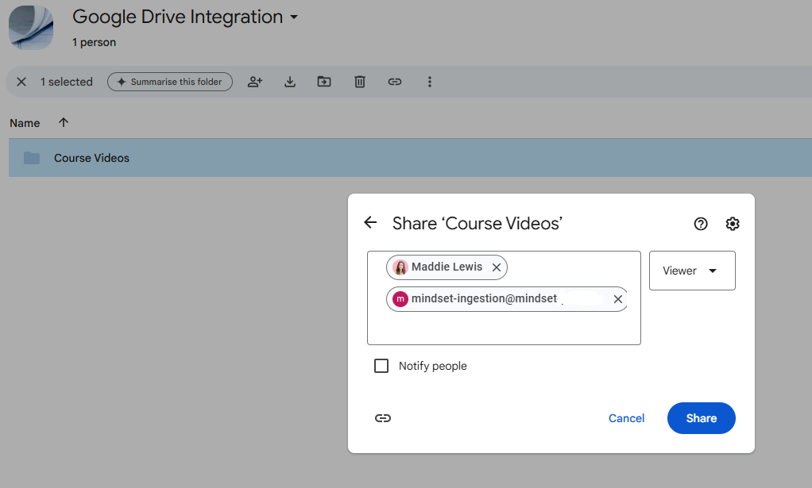

# Google Drive Integration Set-Up

With this integration, we can sync data from your Google Drive into our knowledge banks. We will ingest all content from a folder in your Shared Drive into a knowledge bank and **automatically sync updates every week.** Any new files will be added, and any deleted files will be removed—ensuring your knowledge bank always stays up to date.

#### **File formats supported** 

📄 **Documents:** Google Docs, DOCX, PDF, txt\
📊 **Presentations:** Google Slides, PPTX\
🎵 **Audio:** MP3\
🎥 **Video:** MP4

We do not support PDF files with no page-breaks.

#### **File size limit** 

We don’t impose a strict file size limit, but very large PPTX files, and documents with extensive tabular data may not process correctly.

#### **Can we ingest from subfolders?** 

✅ **Yes!** We are able to ingest subfolders but it makes the deletion process more difficult depending on your setup, if you experience issues, reach out to us at [integrations@mindset.ai](mailto:integrations@mindset.ai).

#### **Permissions Required** 

Our service account must have **Viewer** access to your Shared Drive.

❌ "**Contributor**" will NOT work, as only **Viewers** can download files, which is essential for this integration.

### **Step-by-step instructions** 

1. **Create a Shared Drive**
   * This will store all the files you want to sync into your knowledge bank.
2. **Add Your Content**
   * Move or upload all the files into this Shared Drive.
3. **Grant Access to Mindset AI**
   * Add your Solutions Engineer and a Mindset service account as Viewers of the Shared Drive.
   * We will share the service account details with you once we begin the setup process.
   *    If you revoke this access, all the ingested content will be deleted from your knowledge bank, see below.

       <figure><figcaption></figcaption></figure>
4. **Our Solutions Engineer Sets Up the Integration**
   * Once access is granted, our team will configure the integration for you.
5. **Syncing Begins**
   * Your knowledge bank will now automatically sync with the Shared Drive folder on a weekly basis.
6. **Adding More Folders Later?**
   * If you want to sync additional folders, just email `integrations@mindset.ai`, and we’ll set up a new process for you.

#### How to stop the sync 

You can stop the sync by reaching out to our integrations team at [integrations@mindset.ai](mailto:integrations@mindset.ai). If you revoke access to your GDrive folder from our Solutions Engineer or our service account, all of the content in your synced knowledge bank will be deleted.

#### **General Best Practices** 

* **One folder per knowledge bank** – Keep your structure simple for better organization.
* **Everything in the synced folder will be ingested -** there is currently no way to exclude specific files from a synced folder.
* **Avoid duplicates –** The agent won’t recognize duplicates and may recommend the same file more than once.

#### See our best practises for data selection - link 
