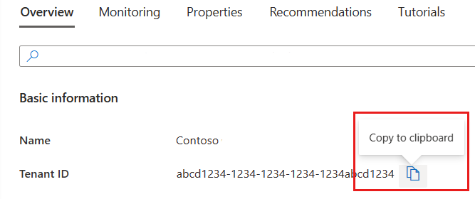

# SharePoint Integration Set-Up

With this integration, we can sync data from your SharePoint into our knowledge banks. We will ingest all content from a folder in a SharePoint site or we can ingest the entirety of a site into a knowledge bank and **automatically sync updates every week.** Any new files will be added, any deleted files will be removed, and any updated files will be updated—ensuring your knowledge bank always stays up to date.

#### **File formats supported** <a href="#file-formats-supported" id="file-formats-supported"></a>

📄 **Documents:** Google Docs, DOCX, PDF, txt\
📊 **Presentations:** Google Slides, PPTX\
🎵 **Audio:** MP3\
🎥 **Video:** MP4

#### **File size limit** <a href="#file-size-limit" id="file-size-limit"></a>

See our page on file size limits here.&#x20;

#### **Can we ingest from subfolders?** <a href="#can-we-ingest-from-subfolders" id="can-we-ingest-from-subfolders"></a>

✅ **Yes!** By default we will ingest all content from any subfolders within the site or folder we are ingesting from.

We ingest subfolders but it makes the deletion process more difficult depending on your setup, if you experience issues, reach out to us at [integrations@mindset.ai](mailto:integrations@mindset.ai).

#### **Permissions Required** <a href="#permissions-required" id="permissions-required"></a>

You will need to authorize our Azure app and then specify which sites we can access.

We use **Sites.Selected** permissions, meaning we do **not** have default access to any sites—you must explicitly grant access to specific sites.

&#x20;

### **Step-by-step instructions** <a href="#step-by-step-instructions" id="step-by-step-instructions"></a>

**You will need Sharepoint Admin access rights to follow the process below. We recommend jumping on a call with our Solutions Engineer to go through this process.**&#x20;

#### **Step 1:** Sharing your tenant ID with us. <a href="#step-1-sharing-your-tenant-id-with-us" id="step-1-sharing-your-tenant-id-with-us"></a>

First you will need to **share** your **tenant ID** with us.

**How to find your Microsoft Entra tenant**

1. Sign in to the [Azure portal](https://portal.azure.com/).
2. Confirm that you are signed into the tenant for which you want to retrieve the ID. If not, [switch directories](https://learn.microsoft.com/en-us/azure/azure-portal/set-preferences#switch-and-manage-directories) so that you're working in the right tenant.
3. Under the Azure services heading, select **Microsoft Entra ID**. If you don't see **Microsoft Entra ID** here, use the search box to find it.
4. Find the **Tenant ID** in the **Basic information** section of the **Overview** screen.
5. Copy the **Tenant ID** and send this to us.

&#x20;

<figure><figcaption></figcaption></figure>

 You can also find your tenant programmatically by using [Azure Powershell](https://learn.microsoft.com/en-us/azure/active-directory/fundamentals/how-to-find-tenant#find-tenant-id-with-powershell)

#### **Step 2:** Authorize our Azure App on your tenant <a href="#step-2-authorize-our-azure-app-on-your-tenant" id="step-2-authorize-our-azure-app-on-your-tenant"></a>

Once we have your Tenant ID, we will send you an authorization link.

1. Open the provided link.
2. Sign in as a Microsoft admin.
3. Click **Accept** to authorize the integration.


This allows our app to securely connect to your SharePoint environment.

#### **Step 3: Get the Site ID for the SharePoint Sites You Want to Sync** <a href="#step-3-get-the-site-id-for-the-sharepoint-sites-you-want-to-sync" id="step-3-get-the-site-id-for-the-sharepoint-sites-you-want-to-sync"></a>

We need the **Site ID** of each SharePoint site you want us to access.

**How to Retrieve a Site ID**

1. Open [Microsoft Graph Explorer](https://developer.microsoft.com/en-us/graph/graph-explorer) and sign in as an **admin.**
2. Run the following GET request: [https://graph.microsoft.com/v1.0/sites/](https://graph.microsoft.com/v1.0/sites/){**sharepoint\_url**}:/sites/{**site\_name**}
   1. `{sharepoint_url}` is your SharePoint root domain (e.g., `companyname.sharepoint.com`).
   2. `{site_name}` is the exact name of the site (visible in the URL when navigating the SharePoint site).
3. Look for the **Site ID** in the response.

💡 **If you get a permissions error**, you may need to temporarily grant `Sites.FullControl.All` in Graph Explorer to retrieve the Site ID.

#### **Step 4: Grant Our App Access to the Selected Sites** <a href="#step-4-grant-our-app-access-to-the-selected-sites" id="step-4-grant-our-app-access-to-the-selected-sites"></a>

Once you have the Site ID, you must explicitly grant access to our app by making a **POST request** in Microsoft Graph Explorer.

**How to Grant Access**

1. Run the following **POST** request: [https://graph.microsoft.com/v1.0/sites/](https://graph.microsoft.com/v1.0/sites/){**site\_id**}/permissions
2. Use this JSON body:

```json
{
    "roles": [
        "read"
    ],
    "grantedToIdentities": [
        {
            "application": {
                "id": "{client_id}",
                "displayName": "{App Name}"
            }
        }
    ]
}
```

* `roles`: We request `"read"` access by default (this allows us to view files but not modify them).
* `client_id` and `App Name` will be provided by Mindset.

 **Important:** You must repeat this request for **each site** you want to sync.

#### **Step 5: Share the Site IDs with Mindset** <a href="#step-5-share-the-site-ids-with-mindset" id="step-5-share-the-site-ids-with-mindset"></a>

After granting access, share the Site IDs with us and specify which folders or drives should be ingested.

**Example Submission Format:**

| Site ID | Ingested Content                                 |
| ------- | ------------------------------------------------ |
| `xxxxx` | All drives & folders                             |
| `yyyyy` | Drive A (all folders), Drive B (folders X, Y, Z) |

This ensures we only sync the data you need.

#### **Step 6: Integration Setup & Syncing** <a href="#step-6-integration-setup-and-syncing" id="step-6-integration-setup-and-syncing"></a>

Once access is confirmed, our team will configure the integration for you. Your knowledge bank will now automatically sync **weekly**.

&#x20;

#### **Adding More Folders or Sites Later?** <a href="#adding-more-folders-or-sites-later" id="adding-more-folders-or-sites-later"></a>

If you want to sync additional folders, just email [integrations@mindset.ai](mailto:integrations@mindset.ai), and we’ll set up the process for you.

&#x20;

#### **Best Practices for Selecting Data** <a href="#best-practices-for-selecting-data" id="best-practices-for-selecting-data"></a>

* **Quality over quantity!**
  * When choosing what to sync, focus on the most relevant and useful data rather than uploading everything.
* **Think of it like training your agent**
  * A well-trained agent performs better with focused, high-quality information rather than an overwhelming amount of general data.
* **Avoid unnecessary clutter**
  * The more targeted your content, the more accurate and helpful your agent’s responses will be.
* **Avoid duplicates**
  * The agent won’t recognize duplicates and may recommend the same file more than once.
