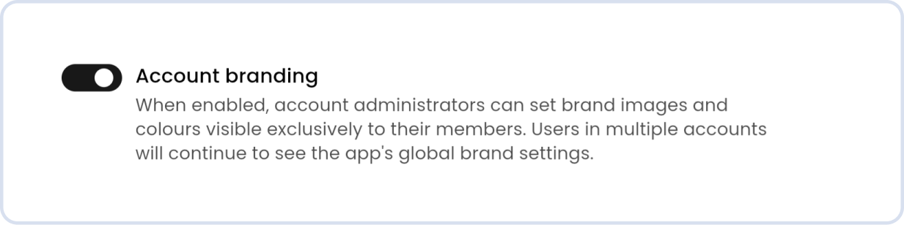
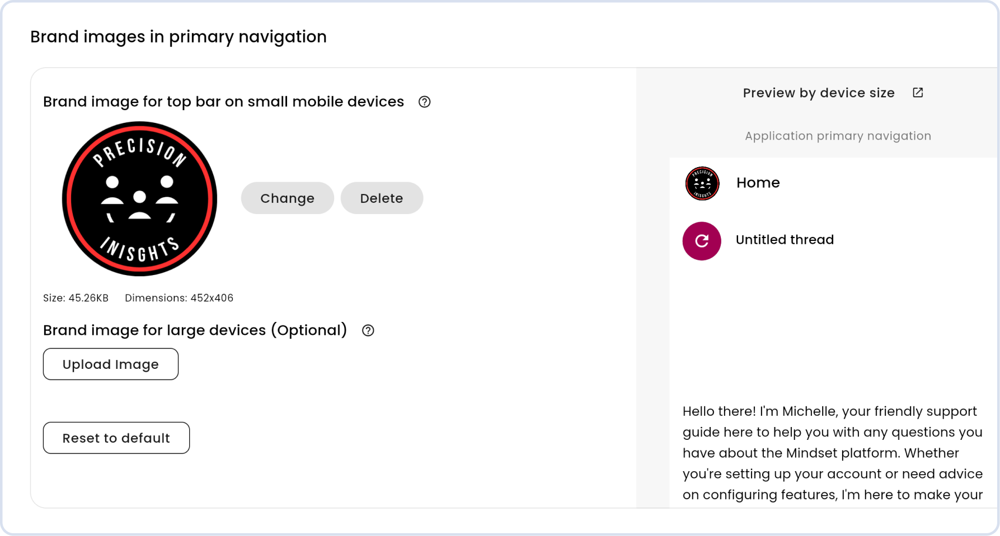

# How to configure Account branding

Account branding gives an account or app admin the ability to customize the colors and logos of the main application navigation that the account members see, allowing them to display their own brand. With this feature, admins can add their organization's logo, adjust the primary navigation colors, and apply other branding elements—creating a more familiar and professional look for account users.

But it’s not just about the visual experience. Account branding also gives app owners the flexibility to offer a more exclusive, tailored experience to certain customers. Whether it’s as a premium feature, a value-added service, or even an upsell opportunity, this feature helps businesses strengthen their brand, build customer loyalty, and create new revenue opportunities.


Walkthrough Video


### Configuring the brand of an Account

App administrators can enable “**Account branding**” on a per-account basis, giving them full control over which accounts have access to this feature. App administrators can do this via the Account Details tab.&#x20;

<figure><figcaption>
Account Branding toggle
</figcaption></figure>

Once enabled for an account, a new "**Account branding**" tab will appear in the account admin portal, where branding customization can begin.&#x20;

### Customizing an Account's branding

By default, an account starts with the app’s branding. From there, app admins or account admins can apply custom branding elements, including:&#x20;

* **Logos:** Update the small and large logos displayed in the left navigation.&#x20;
* **Primary Navigation Styling**: Customize the look and feel of the main navigation, including:&#x20;
  * Surface color&#x20;
  * Icon & text color&#x20;
  * Active & inactive tab colors

<figure><figcaption>
Account branding logo options
</figcaption></figure>

If an admin ever wants to revert to the original app branding, they can simply select "**Reset to Default.**"

The Account Details tab remains unchanged, ensuring key account information stays consistent regardless of branding updates.

### How does Account Branding work for users in multiple accounts?

Since we can only display one branded experience at a time, users who are members of multiple accounts will always see the default app branding instead of any custom branding.&#x20;

**How It Works:** If a user belongs to more than one account, and at least one of those accounts has branding applied, they will still see the default app branding - custom branding is not applied in these cases.&#x20;

Example: **Bob Smith** is a member of **Account B** and **Account C** within **Product A**. Even if **Account B** has account branding applied, Bob will still see **Product A's** default branding when accessing his account.

If you do not have access to Accounts branding, please contact your customer success representative who will share more information.&#x20;
