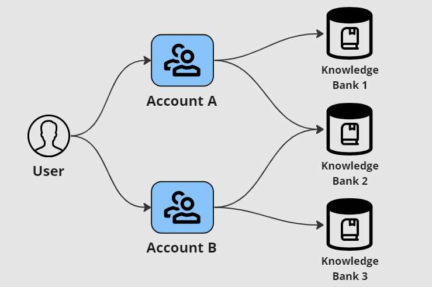

# Knowledge Bank Entitlement


The way you manage your users access to content within a Knowledge Bank is changing with the implementation of Agents. The Knowledge Assistant and direct entitlement to Knowledge banks will reach end of life no later than the 1st of July 2024.


## Assistants, Content discovery, Accounts, and Knowledge banks

Features within the knowledge workflow allow for and AI assistant to provide specific and relevant answers to a users question based on your content or IP.  The content discovery interface allows users to browse through and search within you content. The content is housed within Knowledge banks. Managing access to a Knowlege Banks is done through Knowledge Bank access settings and  Accounts.

<figure><figcaption>
How user entitlement is managed
</figcaption></figure>

### Restricted and open knowledge banks

Knowledge banks can be set to "open access" or "restricted access".&#x20;

All users are entitled to access content in an "open" knowledge bank. The knowledge assistant will always be able to draw its responses from content within these banks and the content discovery area will display this content.&#x20;

Entitlement to a "restricted" knowledge bank is provided through accounts. When editing a restriced knowledge bank you can select any number of accounts. Members of these accounts will be entitled to access content in these banks through both the assistant and the content discovery areas.

A user can exist in your application without belonging to any account, or it can be a member of up to 10 accounts.

## Upcoming changes - Agents and knowlege bank entitlement

While the assistant is a powerful tool, access to large quantities of data can inhibit the assistants ability to provide accurate and specific responses. It is also a challenge to serve multiple use cases, or provide solutions to multiple needs within a single assistant configuration.

Agent are the next generation of AI assistant. Agents are more accurate and allow for greater configurability to serve particular needs. In order to ensure that Agents provide answers relevant to their specifc purpose, agent are given access to specific knowledge banks.  Entitlement to use an agent is also managed through accounts. With this additional level of control, managing access for user would become especially complex if you  had to manage access to the knowledge banks and agents at throuh accounts and had to manage the agents access to the knowledge bank as well. This would often result in conflicting permissions that would limit an Agents ability to function, and would be hard to spot and resolve.

Moving forward a users entitlement to any knowledge bank will be governed by their access to Agents through their account membership.

For more details  ->  [agent-entitlement-and-knowledge-banks.md](../../agents/agent-entitlement-and-knowledge-banks.md "mention")

### Migration and preperation

In order to allow for a smooth transition between the knowledge assistant and agent, we have ensured that knowledge bank and agent entitlement can exist side by side, while the assistant workflow is available to users. This allows you to set up your agent entitlement and make a clean switch when you are ready.  The migration process is as follows:

1. Review Knowledge bank entitlement at the account level
2. Create an configure agents and their entitlement to knowledge banks
3. Set up agent entitlement for accounts.
4. Make agents available for users from agent configuration.
5. Replace the assistant function with agents in the navigation and layout area

### Review knowledge bank entitlement

Review each knowledge bank taking note of it's access type, Open or Restricted, and if it is restricted the accounts that have access.

### Create and configure agents

Create one or more agents that have access that collectively have access to your open knowledge banks.  Ensure that you configure your agents to manage the needs of your users and assign the banks the agents will need to fulfil their tasks.  Ensure that you keep the agent set to "Open access".

Next create one or more agents that have access to your restricted knowledge banks. Remember that an account user will have access to all knowledge banks their agents are entitled to use. If you have knowledge banks that should only be available to certain accounts, agents will need to be created to manage that entitlement. Ensure that you set these agents to "Restricted access"

### Set up agent entitlement for accounts

For each restricted agent, provide access to the accounts that should have access. Check back to information gathered in the first step to ensure that all accounts have at least one agent that can access each of the restricted knowledge banks they are entitled to use. When the assistant function is removed from the user UI, entitlement to knowledge banks will only be goverened by the agents an account has access to.

### Make agents available

Each agent can be created and configured from the administation console without impacting users. In this migration, agents will not be available to users as the workflow has not yet been made available through the Navigation and Layout tab under the Design section.

For each configured agent, access the configuration and select the "Enable access to agent for users" switch. This ensures all agents will be available in the next step

### Replace the Assistant function with Agents

Access the Design area and select the Navigation and layout tab. Select "Configure" button for the navigation tab that currently contains the Knowledge Assistant and go to the "Workflows" tab. Remove the Assistant and add a new workflow. Selec "Agents" from the drop down.&#x20;

Save the changes and your migration is complete.&#x20;

